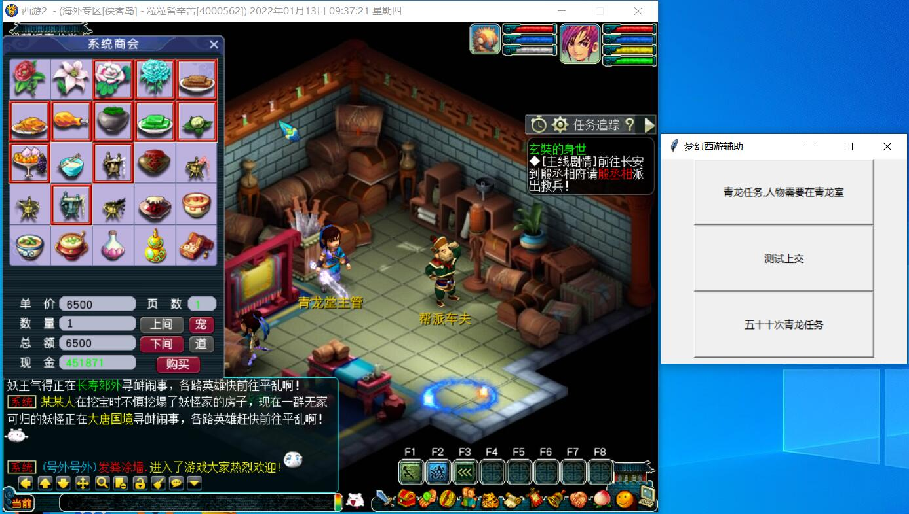

# game-script

一个基于计算机视觉开发的梦幻西游辅助脚本，主要是刷青龙任务

人生苦短

从有想法到弄出来花了两三天，很多知识都是现学的，脚本逻辑并不做特别的优化

【注】本工具不为盈利，只为兴趣，学以致用而已。

麻烦觉得不错的人点个star哦！

【注1】脚本或程序需要跑在管理员权限运行才行。因为鼠标点击需要管理员权限。只截图不需要。

【注2】本项目代码完整，文中只是展示了一部分。

系统环境：
    win10 + python3 + conda管理 

本教程分四部分：

（1）使用python 的pywin32这个库来实现对Windows窗口的操作和点击。

（2）使用PIL来抓取图像。

（3）使用CV2实现识别图片上按钮与任务物品。

（4）easyOcr读取图片上的文字，获取到任务所需物品

## 一、主要运算作用
特别注意由于现在的高分辨率屏幕都采用了 125%或者150%缩放，鼠标像素转向窗口点击操作都需要做特别的处理，
代码中我使用了：scale变量进行处理125%缩放，但是不保证其他分辨率下工作效果

### 运行时候，需要把窗口放置到最上方！！并且无遮挡，否则图片识别可能产生不可预料的问题
### 窗口内一定需要把系统商会的购买框打开，不能关闭，如下图的位置摆好就ok了，运算过程中请不要移动窗口位置以及内部操作

运行结果以及日志。

items 文件夹下面放置的是物品的识别图片
action 文件夹下是操作图片
因为基于图像识别，每次完成任务都会生成临时图片

【注】脚本或程序需要跑在管理员权限运行才行。因为鼠标点击需要管理员权限。只是截图不需要。
